# Issue Buddy Tools

**Version 1.0.0 | June 2026**

**Issue Buddy Tools** is a collection of tools designed to assist Autodesk Revit users during the final stages of information delivery. 

The add-in includes **five efficient quick-action commands** engineered to streamline final submittal and information delivery processes, saving countless hours:

* **CreatePrintSet**: Set up custom print sets driven entirely by sheet revisions.
* **PDFSplitter**: Export dynamically named PDFs and DWGs.
* **ModelStripper**: Clean and protect project data before model delivery.
* **RevisionViewer**: Visualize historical sheet revisions across the entire model.
* **Bonus Tool**: Create print sets directly from your Project Browser selection.

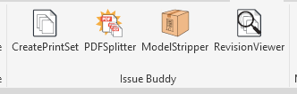

Below is a brief overview of the tools included in this set.

---

## Tool Overview

### 1. CreatePrintSet
Use this tool to generate a Revit print set driven entirely by sheet revisions. Simply select a single revision or a range of revisions, specify a name, and click OK. It’s that simple. 

With this tool, you will never accidentally miss a revised sheet in your submittal package.

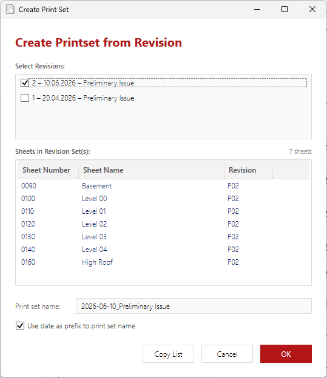

---

### 2. PDFSplitter
Once a print set is generated, print it to a single combined PDF using your preferred PDF driver (ensuring the option *"Combine multiple selected views/sheets into a single file"* is enabled). This combined file is used as the base input for the next step.

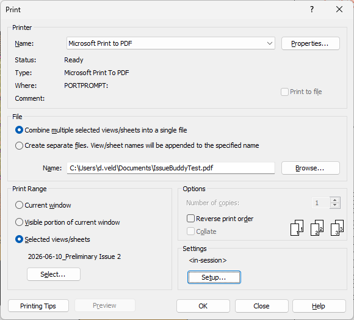

The **PDFSplitter** reads the combined document and splits it into individual files matching the page order of your print set. One by one, it generates neatly separated PDFs and accompanying DWGs.

* **Full Naming Control**: Customize your output file names dynamically using any available project or sheet parameters.
* **Reusable Templates**: Save your parameter mappings as naming presets to seamlessly match company or client information protocols.

#### How It Works:
* **Step 1**: Select your combined PDF or drag and drop it directly into the target UI box.
  
  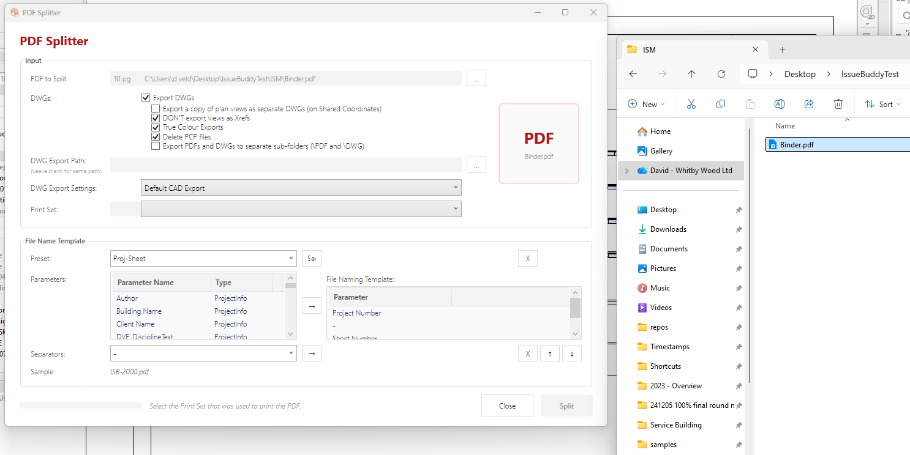

* **Step 2**: Select your preferred DWG export settings, choose the matching print set (the one used to print your combined PDF), and select or create a naming template.
  
  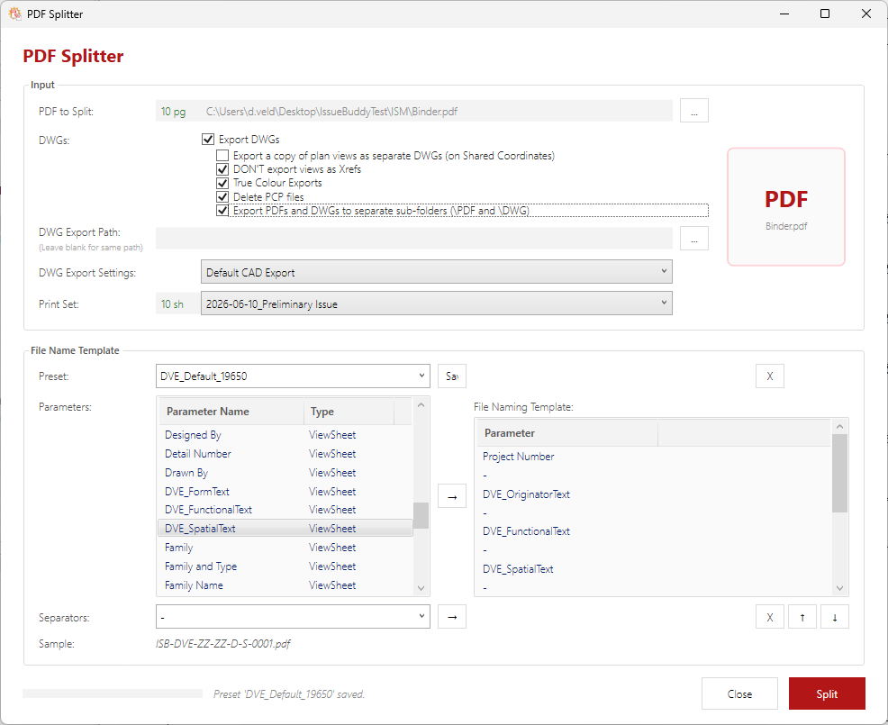

* **Step 3**: Click **Split**. The tool will process the document, generating individual PDFs and corresponding DWGs in your target output directory.
  
  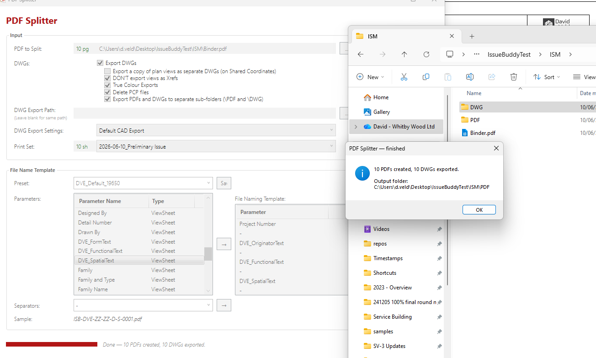

#### Output Results Example:
| Exported PDFs | Exported DWGs |
|---|---|
| 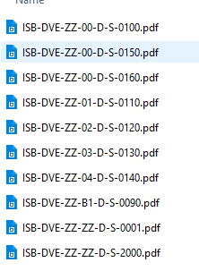 | 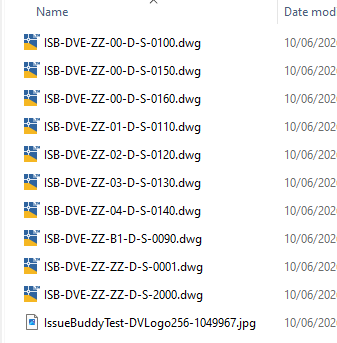 |

---

### 3. ModelStripper
The **ModelStripper** exports and strips a Revit model to a specified location. Users can select exactly which non-model components to strip away prior to export, including:
* Views
* Sheets
* Legends
* Schedules
* View Templates
* Revit Links (automatically unloaded)
* Model Groups (automatically ungrouped)

A central file or a cloud-based shared model will automatically become detached from its source. After processing, the tool automatically prompts the user to purge unused elements, trimming the file down to its most compact and secure version.

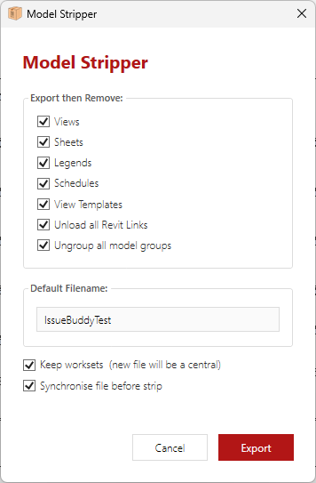

---

### 4. RevisionViewer
The **RevisionViewer** allows you to inspect both current and historical revisions across all sheets within the active Revit model. 

It provides a clean matrix table of your revision streams, making it effortless to cross-check sheet statuses, compile issue records, or generate Task Information Delivery Plans (TIDPs). The completed matrix table can be exported directly to a CSV file for external documentation and project tracking workflows.

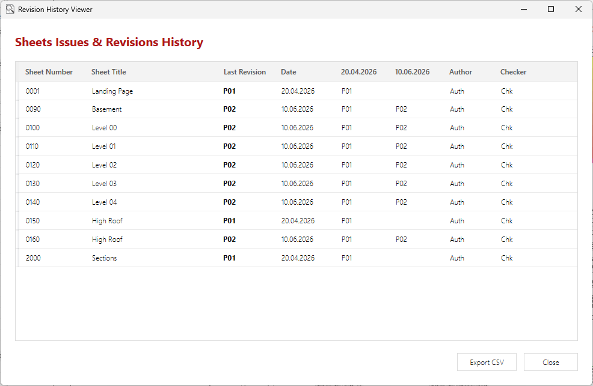

---

### 5. Bonus Tool: Print Set from Selection
When Issue Buddy Tools are installed, a custom context-menu command is integrated directly into the Revit Project Browser. Simply highlight a selection of sheets in your Project Browser, right-click, and choose **IssueBuddy -> Create Print Set from Selection**.

It is fast, intuitive, and eliminates manual list building.

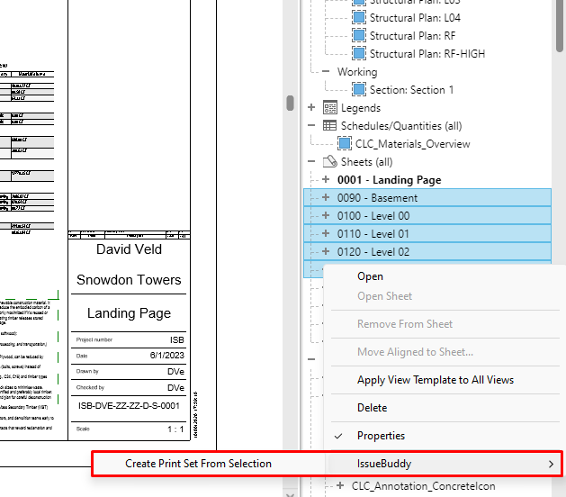

> 📌 **Note:** This specific context-menu feature is supported in Revit 2025 and higher.
